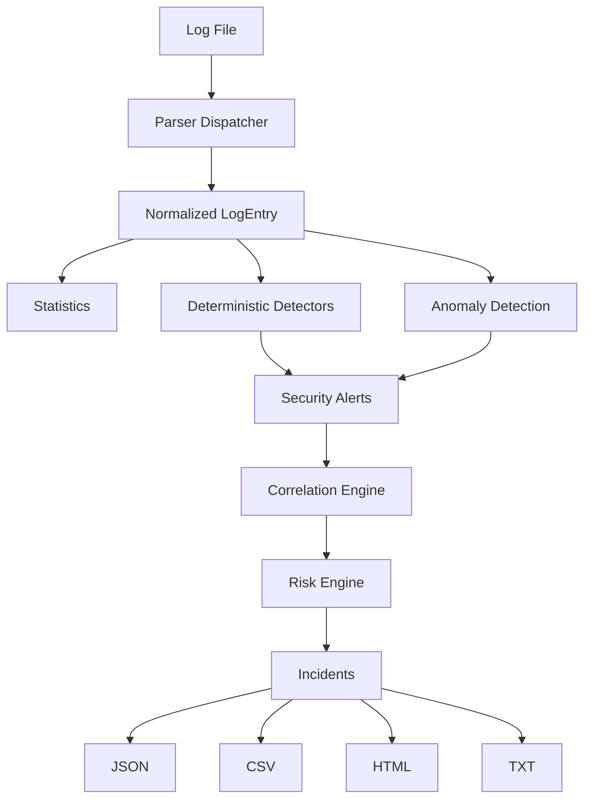

# Smart Log Analyzer

Smart Log Analyzer is a Python-based hybrid security analytics platform for
parsing heterogeneous system and web logs, detecting known attacks, identifying
anomalous behavior, correlating related alerts, calculating risk, and generating
security reports.

It runs entirely **local and offline**: read a log file, analyze it, write
reports. There are no external threat-intelligence APIs, dashboards, or
automated blocking actions.

**Stack:** Python 3.11+ · scikit-learn · pytest · Ruff · GitHub Actions  
**Version:** 0.1.0 · **License:** MIT

---

## Features

- Mixed-format log parsing (Linux SSH, Windows auth, Apache access)
- Deterministic attack detectors with configurable thresholds
- Optional Isolation Forest behavioral anomaly detection
- Alert correlation into incidents and global risk scoring
- JSON / CSV / HTML / TXT reporting
- Seeded synthetic dataset generator for demos and tests
- pytest suite, coverage reporting, and GitHub Actions CI

---

## Architecture



`AnalysisService` orchestrates parsing → statistics → detectors (and optional
anomaly detection) → correlation → risk scoring into a single
`AnalysisResult`. The CLI (`main.py`) handles presentation and report export.

---

## Detection Capabilities

### Parsing

| Capability | Notes |
| ---------- | ----- |
| Linux SSH / syslog-style auth | Accepted / failed password events |
| Windows authentication | EVENT_ID-style lines |
| Apache access logs | Common / combined-style request lines |
| Mixed-format files | Dispatcher selects parser per line |
| Malformed lines | Counted and skipped without crashing |

### Deterministic detection

| Detection         | Type      | Typical severity |
| ----------------- | --------- | ---------------- |
| Brute Force       | Rule      | High             |
| Password Spray    | Rule      | High             |
| SQL Injection     | Rule      | Critical         |
| XSS               | Rule      | High             |
| Impossible Travel | Heuristic | High             |
| Insider Threat    | Heuristic | Medium           |
| Anomalous Behavior| ML        | Medium–High      |

Severity and risk scores are computed per alert/incident from evidence and
configuration; the table lists typical defaults, not fixed universal values.

### Analytics

- Aggregate statistics (counts, unique users/IPs, top sources)
- Alert correlation into time-windowed incidents
- Global incident risk scoring
- Optional Isolation Forest anomaly detection

### Reporting

- `security_report.json`
- `security_alerts.csv` / `security_incidents.csv`
- `security_report.html`
- `summary.txt`

### Tooling

- Seeded synthetic generator (`tools/generate_logs.py`)
- Local benchmark (`tools/benchmark.py`)
- pytest + pytest-cov + Ruff + GitHub Actions

---

## ML Anomaly Detection

**Rule-based detection** finds known attack patterns (signatures and
heuristics).

**Behavioral anomaly detection** flags unusual aggregates relative to the
*analyzed dataset* using scikit-learn’s Isolation Forest.

The Isolation Forest model does **not** determine whether activity is
malicious with certainty and does **not** output an attack probability.

| Setting | Default | Meaning |
| ------- | ------- | ------- |
| Features | Per-IP (and optionally per-user) vectors | Event counts, fail ratios, HTTP errors, unusual-hour activity, diversity, etc. — derived only from raw `LogEntry` fields |
| `minimum_samples` | 20 | Skip fitting when too few entity vectors |
| `contamination` | 0.05 | Expected outlier fraction for Isolation Forest |
| `random_state` | 42 | Reproducible fits |
| `alert_threshold` | 70.0 | Heuristic 0–100 anomaly score gate |
| `n_estimators` | 100 | Forest size |

`anomaly_score` is a heuristic transform of Isolation Forest’s
`decision_function` (higher = more anomalous). Disable with `--no-anomaly` or
`AnomalyConfig(enabled=False)`.

---

## Installation

Requires **Python 3.11+** (CI uses 3.12).

```bash
python -m venv .venv
```

Activate the virtual environment:

Windows (PowerShell):

```powershell
.venv\Scripts\Activate.ps1
```

Linux / macOS:

```bash
source .venv/bin/activate
```

Then install dependencies:

```bash
python -m pip install -r requirements.txt
```

---

## Quick Start

A seeded demo log (`logs/security.log`) is included for immediate use.

```bash
python main.py logs/security.log
```

---

## CLI Usage

```bash
python main.py --help
python main.py --version
```

| Argument | Description |
| -------- | ----------- |
| `logfile` | Path to the log file |
| `--verbose` | Detailed diagnostics |
| `--quiet` | Summary only |
| `--no-color` | Disable ANSI styling |
| `--no-anomaly` | Skip Isolation Forest |
| `--report KIND` | `json`, `csv`, `html`, `summary`, or `all` (repeatable) |
| `--output DIR` | Report directory (default: `reports/`) |
| `--format` | Console mode, or alias for `--report` |

Examples:

```bash
python main.py logs/security.log
python main.py logs/security.log --verbose
python main.py logs/security.log --no-anomaly
python main.py logs/security.log --report all
python main.py logs/security.log --report all --output reports/
```

---

## Dataset Generator

```bash
python tools/generate_logs.py --entries 1000 --seed 42 --scenario demo
```

Useful flags: `--entries`, `--seed`, `--scenario`, `--output`, `--quiet`.
Seeds make datasets reproducible for demos and tests.

---

## Demo

```bash
python tools/generate_logs.py \
  --entries 1000 \
  --seed 42 \
  --scenario demo

python main.py logs/security.log --report all
```

The seeded demo (`--seed 42 --scenario demo`) was validated to produce alerts
for brute force, password spray, SQL injection, XSS, impossible travel,
insider threat, and anomalous behavior, plus correlation, risk scoring, and
all report formats. Exact anomaly counts can vary with sample size and
configuration — do not hardcode them.

---

## Reports

```bash
python main.py logs/security.log --report json
python main.py logs/security.log --report csv
python main.py logs/security.log --report html
python main.py logs/security.log --report all
```

Artifacts (under `--output`, default `reports/`):

| File | Contents |
| ---- | -------- |
| `security_report.json` | Full structured analysis document |
| `security_alerts.csv` | Flattened alerts |
| `security_incidents.csv` | Flattened incidents |
| `security_report.html` | Standalone HTML report (user-controlled fields HTML-escaped) |
| `summary.txt` | Concise text summary |

Generated reports are gitignored; keep the `reports/` directory via `.gitkeep`.
Other generated `logs/*.log` files are ignored; the included demo
`logs/security.log` is tracked intentionally for Quick Start.

---

## Example Output

Illustrative console summary from the seeded demo (`--seed 42 --scenario demo`).
Exact alert counts can vary slightly with anomaly detection:

```text
============================================================
SMART LOG ANALYZER
============================================================

Input       : logs\security.log
Analysis    : 0.40 seconds

PARSING
------------------------------------------------------------
Total Lines       : 1000
Parsed            : 1000
Malformed         : 0
Unsupported       : 0

LOG SUMMARY
------------------------------------------------------------
Total Events      : 1000
Linux             : 456
Windows           : 234
Apache            : 310

Successful Logins : 356
Failed Logins     : 334
HTTP Requests     : 310

SECURITY ALERTS
------------------------------------------------------------
Total Alerts      : 83
Critical          : 20
High              : 51
Medium            : 12

INCIDENTS
------------------------------------------------------------
Total Incidents   : 57

REPORTS
------------------------------------------------------------
JSON      : reports\security_report.json
HTML      : reports\security_report.html
...

============================================================
Analysis Complete
============================================================
```

---

## Project Structure

```text
smart-log-analyzer/
├── analyzer/
│   ├── anomaly/           # Isolation Forest + feature engineering
│   ├── correlation/       # Alert → incident correlation
│   ├── detectors/         # Rule / heuristic detectors
│   ├── parsers/           # Linux / Windows / Apache + dispatcher
│   ├── risk/              # Global risk scoring
│   ├── reporting/         # JSON / CSV / HTML / TXT
│   ├── services/          # AnalysisService, offline geolocation
│   ├── models.py
│   ├── config.py
│   ├── exceptions.py
│   ├── normalization.py
│   ├── parser.py
│   ├── statistics.py
│   └── utils.py
├── tests/
│   └── fixtures/
├── tools/
│   ├── generate_logs.py
│   └── benchmark.py
├── logs/
│   ├── .gitkeep
│   └── security.log       # seeded demo dataset (optional)
├── reports/
│   └── .gitkeep
├── .github/workflows/tests.yml
├── main.py
├── requirements.txt
├── pytest.ini
├── ruff.toml
├── .gitignore
├── README.md
└── LICENSE
```

---

## Testing

```bash
pytest -q
pytest --cov=analyzer --cov-report=term-missing
ruff check analyzer tests main.py tools
```

CI (`.github/workflows/tests.yml`) installs `requirements.txt`, runs Ruff,
pytest, and coverage with a 90% floor on Python 3.12.

---

## Performance

Local approximate timings from `python tools/benchmark.py` on a Windows
developer workstation (Python 3.13, ~5k synthetic events). These are
machine-dependent and not product SLAs:

| Stage | Approx. time |
| ----- | ------------ |
| Parsing | ~130 ms |
| Deterministic detection | ~94 ms |
| Feature extraction | ~17 ms |
| Anomaly detection (Isolation Forest) | ~174 ms |
| Correlation | ~7 ms |
| Risk scoring | ~1 ms |
| Report generation | ~263 ms |
| End-to-end analysis (service) | ~428 ms |

Re-run the benchmark locally after changes; document your own numbers rather
than treating README figures as guarantees.

---

## Configuration

Thresholds and toggles live in `analyzer/config.py` as frozen dataclasses
(`AnalyzerConfig` and nested `*Config` blocks). There is no YAML layer.

Examples of configurable areas:

- Detector enable flags and windows/thresholds
- Correlation window and IP/user joining
- Risk score bases and bonuses
- Anomaly contamination, sample minimum, alert threshold, random state

The CLI exposes `--no-anomaly`; other settings are intended for embedding or
tests via `dataclasses.replace` / custom `AnalyzerConfig`.

---

## Limitations

- Offline portfolio / lab tool — not a full SIEM or SOC platform
- Geolocation for impossible travel uses a small deterministic demo map
- Anomaly detection is relative to the current file, not a long-term baseline
- Heuristic detectors can false-positive; review evidence before acting
- Single-process local CLI; no multi-tenant or streaming ingest

---

## Security Considerations

- Log content is treated as **data only** — never executed as code or shell
- Analysis is **local/offline**; no outbound threat-intel or LLM calls
- HTML reports escape user-controlled values (`<`, `>`, `&`, quotes, scripts)
- Report filenames are fixed; `--output` chooses a directory you control
- Do not commit secrets, `.env` files, or production logs into the repo
- The tool does not block accounts, modify systems, or auto-remediate

---

## Roadmap

Possible future directions (not commitments):

- Additional parsers / detector tuning
- Richer offline enrichment maps
- Packaging as an installable CLI entry point
- Optional streaming / watch mode for growing log files

---

## License

MIT — see [LICENSE](LICENSE).
